# Flight Management System - 航班管理系统

## 📋 项目概述

航班管理系统是一个基于 **Spring Boot** 和 **Vue.js** 的现代化航班预订平台，采用前后端分离架构设计。系统支持多角色权限管理，为普通用户提供航班查询、机票预订、订单管理等核心功能，同时为管理员提供航班管理、用户管理、数据统计分析等后台管理能力。

### 🎯 核心特性

- **前后端分离架构**：Vue.js 2.x 前端 + Spring Boot 2.x 后端
- **多角色权限系统**：普通用户 / 管理员双重角色
- **现代化技术栈**：MyBatis-Plus、Druid连接池、Element-UI组件库
- **完整业务闭环**：从航班查询到订单支付的全流程管理
- **数据可视化**：ECharts统计图表展示

---

## 🏗️ 系统架构

### 整体架构图

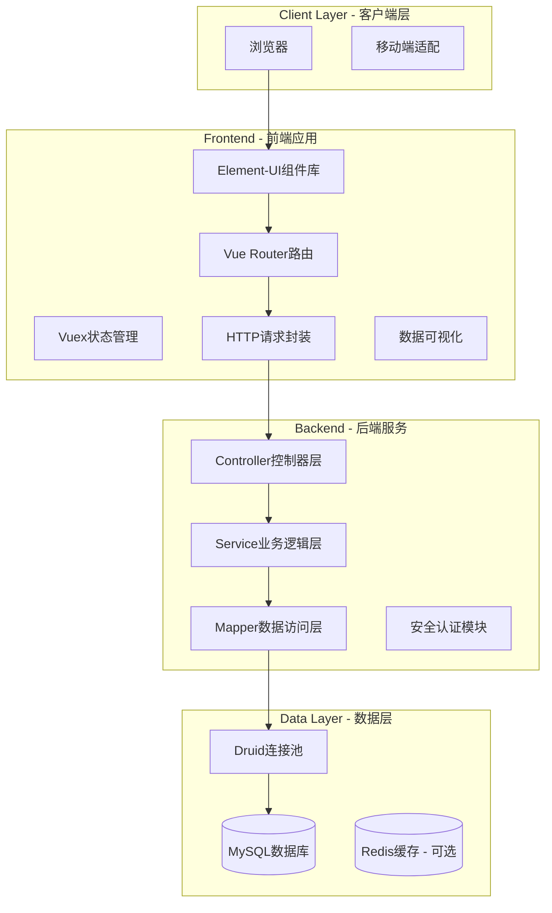

### 技术架构图

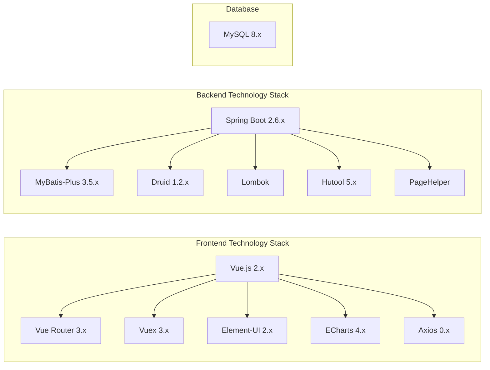

### 分层架构图

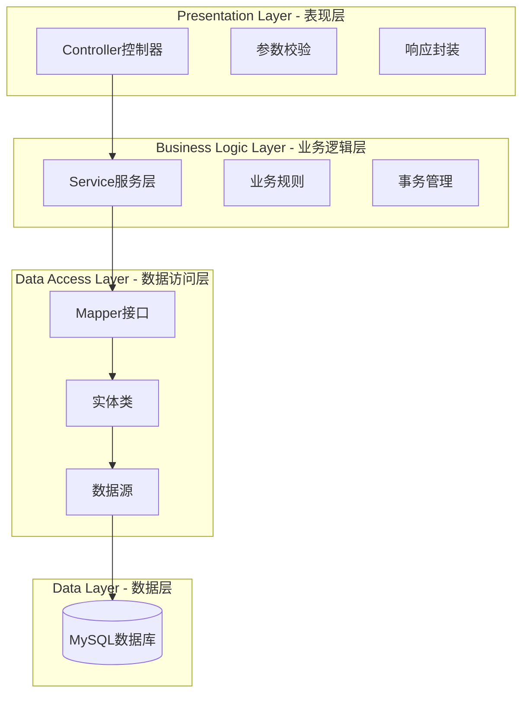

---

## 📁 项目结构

### 目录结构

```
Flight-management-system/
├── README.md                          # 项目文档
├── api-document.md                    # API接口文档
├── air-ticket-reservation.md          # 功能设计文档
├── 后端接口文档.txt                    # 后端接口说明
│
├── backend_v1/                        # Spring Boot后端项目
│   ├── pom.xml                       # Maven配置
│   └── src/main/java/com/calmresponse/
│       ├── AirRouteSystemApplication.java    # 启动类
│       ├── common/                   # 公共模块
│       │   ├── BaseResponse.java     # 基础响应类
│       │   ├── ErrorCode.java        # 错误码定义
│       │   └── ResultUtils.java      # 响应工具类
│       ├── config/                   # 配置模块
│       │   └── CorsConfig.java       # 跨域配置
│       ├── constant/                 # 常量定义
│       │   └── UserConstant.java     # 用户常量
│       ├── controller/               # 控制器层
│       │   ├── admin/               # 管理员接口
│       │   │   ├── AdminFlightController.java
│       │   │   ├── AdminLoginController.java
│       │   │   ├── AdminOrderController.java
│       │   │   └── UserController.java
│       │   └── user/                # 用户接口
│       │       ├── FlightController.java
│       │       ├── OrderController.java
│       │       ├── PassengerController.java
│       │       └── UserLoginController.java
│       ├── dto/                      # 数据传输对象
│       ├── entity/                   # 实体类
│       │   ├── User.java
│       │   ├── Flight.java
│       │   ├── Orders.java
│       │   ├── Passenger.java
│       │   └── BookedSeat.java
│       ├── exception/                # 异常处理
│       ├── mapper/                   # MyBatis映射器
│       ├── request/                  # 请求对象
│       ├── result/                   # 响应结果
│       ├── service/                  # 服务层
│       │   └── Impl/                # 服务实现
│       ├── utils/                    # 工具类
│       └── vo/                       # 视图对象
│
└── air-ticket-reservation-system-pc-master_2/  # Vue.js前端项目
    ├── package.json                  # NPM配置
    ├── build/                        # 构建配置
    ├── config/                       # 项目配置
    └── src/
        ├── main.js                   # 入口文件
        ├── App.vue                   # 根组件
        ├── router/index.js           # 路由配置
        ├── store/                    # Vuex状态管理
        ├── components/               # 公共组件
        │   ├── leftnav.vue
        │   └── navcon.vue
        ├── views/                    # 页面组件
        │   ├── login.vue             # 登录页面
        │   ├── register.vue          # 注册页面
        │   ├── index.vue             # 首页布局
        │   ├── charts/statistics.vue # 数据统计
        │   ├── admin/                # 管理员页面
        │   ├── user/                 # 用户页面
        │   ├── fly/                  # 航班管理
        │   └── order/                # 订单管理
        └── assets/                   # 静态资源
```

---

## 🗂️ 数据库设计

### 实体关系图

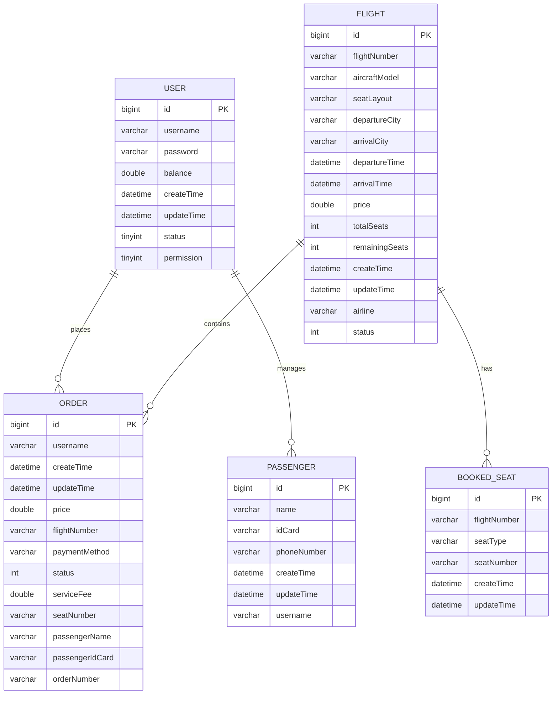

### 数据表说明

#### 1. 用户表 (user)

| 字段名 | 类型 | 说明 |
|--------|------|------|
| id | BIGINT | 主键ID，自增 |
| username | VARCHAR | 用户名 |
| password | VARCHAR | 密码 |
| balance | DOUBLE | 账户余额 |
| create_time | DATETIME | 创建时间 |
| update_time | DATETIME | 修改时间 |
| status | TINYINT | 状态（0正常 1封号） |
| permission | TINYINT | 权限（0用户 1管理员） |

#### 2. 航班表 (flight)

| 字段名 | 类型 | 说明 |
|--------|------|------|
| id | BIGINT | 主键ID |
| flight_number | VARCHAR | 航班号 |
| aircraft_model | VARCHAR | 飞机型号 |
| seat_layout | VARCHAR | 座位布局 |
| departure_city | VARCHAR | 起飞城市 |
| arrival_city | VARCHAR | 降落城市 |
| departure_time | DATETIME | 起飞时间 |
| arrival_time | DATETIME | 降落时间 |
| price | DOUBLE | 票价 |
| total_seats | INT | 总票数 |
| remaining_seats | INT | 余票数 |
| airline | VARCHAR | 航空公司 |
| status | INT | 状态（0未出发 1正在飞行） |

#### 3. 订单表 (orders)

| 字段名 | 类型 | 说明 |
|--------|------|------|
| id | BIGINT | 主键ID |
| username | VARCHAR | 用户名 |
| flight_number | VARCHAR | 航班号 |
| price | DOUBLE | 订单价格 |
| payment_method | VARCHAR | 支付方式 |
| status | INT | 状态（0未支付 1已支付 2退款） |
| service_fee | DOUBLE | 退票手续费 |
| seat_number | VARCHAR | 座位号 |
| passenger_name | VARCHAR | 乘客姓名 |
| passenger_id_card | VARCHAR | 乘客身份证 |
| order_number | VARCHAR | 订单号 |

#### 4. 乘客表 (passenger)

| 字段名 | 类型 | 说明 |
|--------|------|------|
| id | BIGINT | 主键ID |
| name | VARCHAR | 乘客姓名 |
| id_card | VARCHAR | 身份证号 |
| phone_number | VARCHAR | 电话号码 |
| username | VARCHAR | 所属用户 |

#### 5. 已预定座位表 (booked_seat)

| 字段名 | 类型 | 说明 |
|--------|------|------|
| id | BIGINT | 主键ID |
| flight_number | VARCHAR | 航班号 |
| seat_type | VARCHAR | 座位类型 |
| seat_number | VARCHAR | 座位号 |

---

## 🔐 角色与权限

### 用户角色

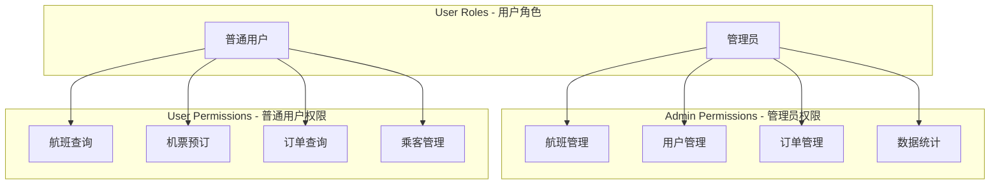

---

## 🚀 核心功能流程

### 用户购票流程

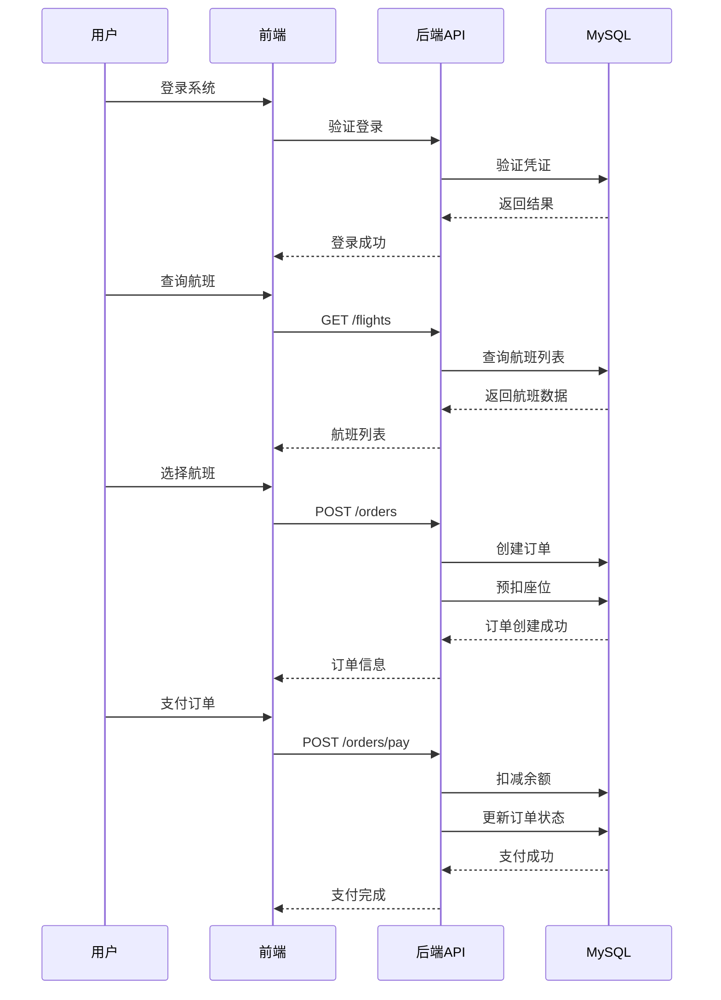

### 管理员管理流程

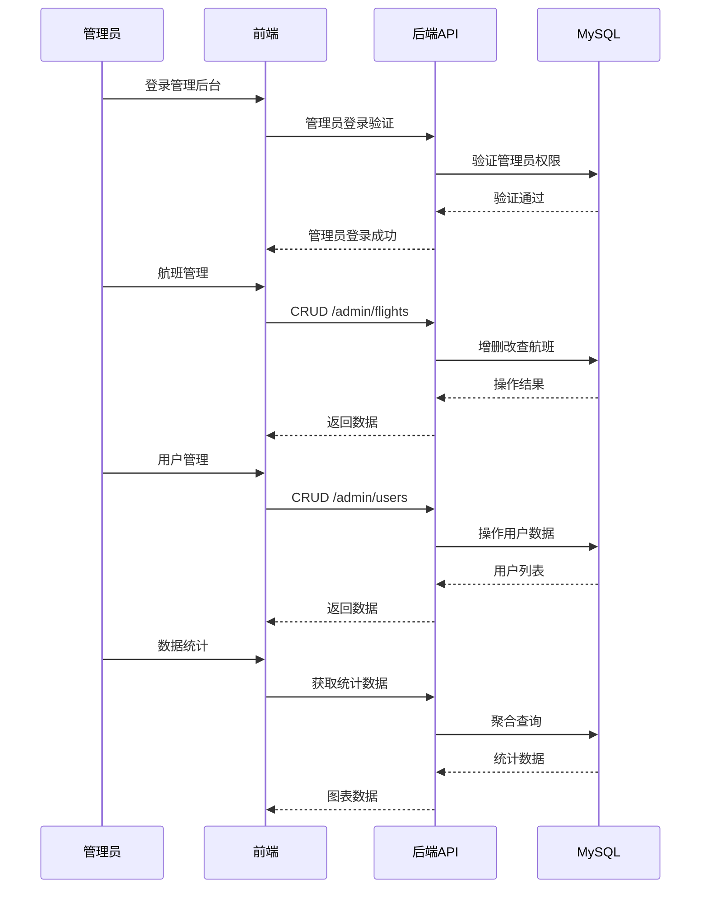

---

## 🌐 API接口设计

### 接口架构图

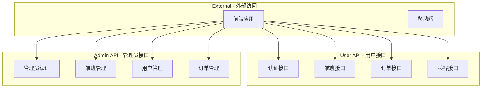

### 主要接口列表

#### 认证模块

| 接口路径 | 方法 | 说明 |
|---------|------|------|
| `/user/register` | POST | 用户注册 |
| `/user/login` | POST | 用户登录 |
| `/admin/login` | POST | 管理员登录 |

#### 航班模块

| 接口路径 | 方法 | 说明 |
|---------|------|------|
| `/flights` | GET | 查询航班列表 |
| `/admin/flights` | POST | 创建航班 |
| `/admin/flights` | PUT | 更新航班 |
| `/admin/flights` | DELETE | 删除航班 |
| `/admin/flights/page` | POST | 分页查询 |

#### 订单模块

| 接口路径 | 方法 | 说明 |
|---------|------|------|
| `/user/orders` | POST | 创建订单 |
| `/user/orders/{id}/pay` | POST | 支付订单 |
| `/user/orders/{id}` | DELETE | 取消/退款 |
| `/admin/orders` | GET | 订单管理 |

#### 用户模块

| 接口路径 | 方法 | 说明 |
|---------|------|------|
| `/user/balance` | GET | 查询余额 |
| `/api/admin/users` | GET | 用户列表 |
| `/api/admin/users/{id}` | PUT | 封禁用户 |

---

## 🛠️ 技术栈详解

### 前端技术栈

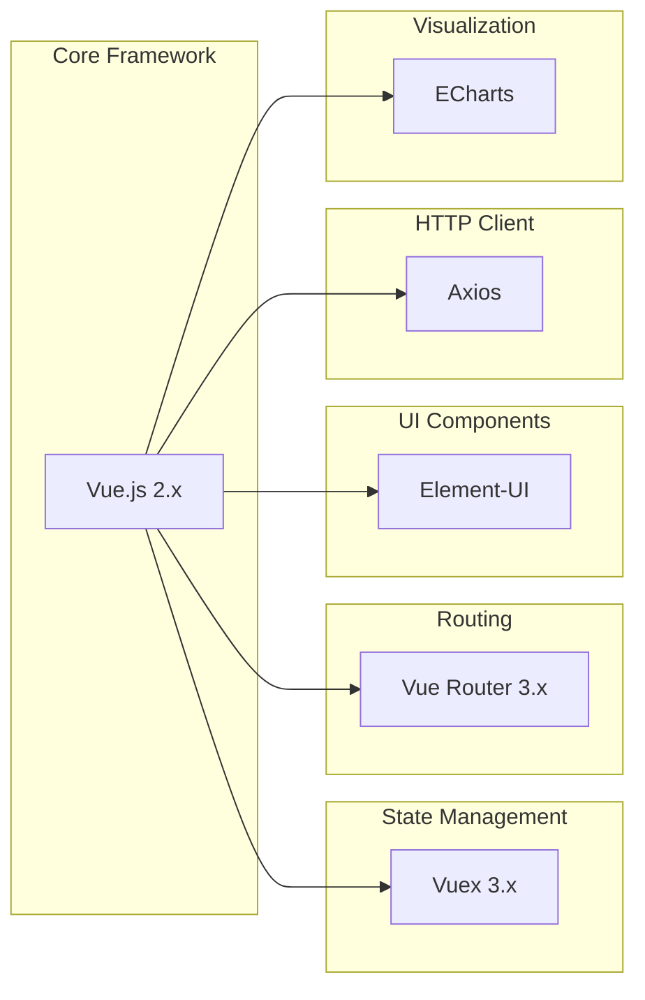

### 后端技术栈

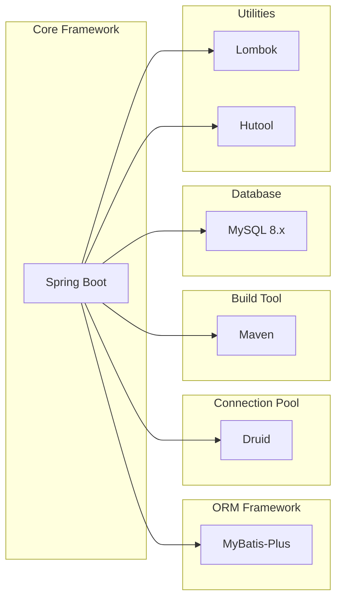

---

## 📊 数据流架构

### 请求处理流程

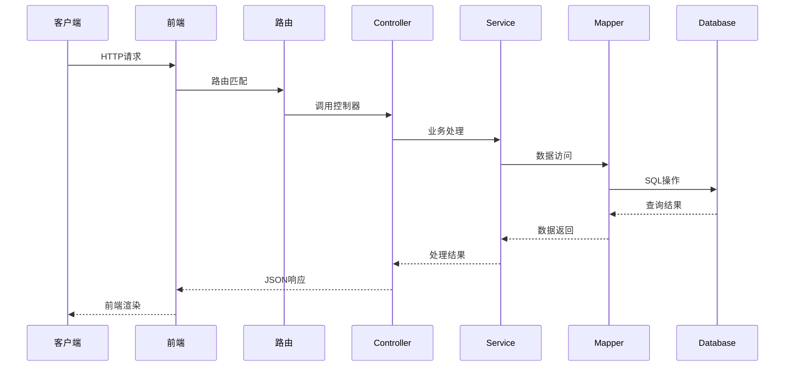

---

## 📱 功能模块

### 用户功能

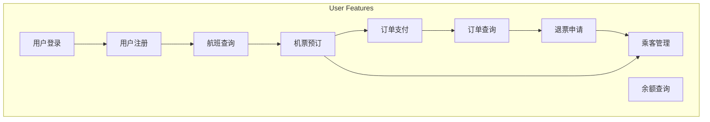

### 管理员功能

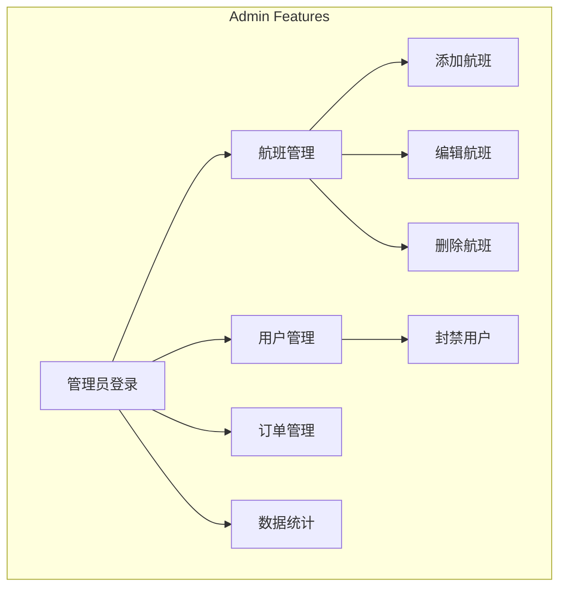

---

## 🔧 快速开始

### 环境要求

- **JDK**: 1.8+
- **Node.js**: 6.0+
- **MySQL**: 8.0+
- **Maven**: 3.0+

### 后端启动

```bash
# 进入后端目录
cd backend_v1

# 安装依赖
mvn clean install

# 启动应用
mvn spring-boot:run

# 默认端口: 8080
```

### 前端启动

```bash
# 进入前端目录
cd air-ticket-reservation-system-pc-master_2

# 安装依赖
npm install

# 启动开发服务器
npm run dev

# 默认访问: http://localhost:9999
```

### 数据库配置

```yaml
# application.yml
spring:
  datasource:
    url: jdbc:mysql://127.0.0.1:3306/calmresponse
    username: root
    password: 123456
    driver-class-name: com.mysql.cj.jdbc.Driver
```

---

## 📁 项目文件说明

### 后端核心文件

| 文件路径 | 功能说明 |
|---------|---------|
| `AirRouteSystemApplication.java` | Spring Boot启动类 |
| `pom.xml` | Maven项目配置 |
| `application.yml` | 应用配置 |
| `CorsConfig.java` | 跨域配置 |
| `Result.java` | 统一响应结果 |
| `ErrorCode.java` | 错误码定义 |

### 前端核心文件

| 文件路径 | 功能说明 |
|---------|---------|
| `src/main.js` | 应用入口 |
| `src/router/index.js` | 路由配置 |
| `src/store/` | Vuex状态管理 |
| `src/views/login.vue` | 登录页 |
| `src/views/index.vue` | 首页布局 |
| `src/views/user/` | 用户页面 |
| `src/views/admin/` | 管理页面 |

---

## 📈 系统特性亮点

### 1. 事务管理
- 订单创建时自动预扣座位
- 退款时自动退还座位
- 支付失败自动回滚

### 2. 手续费计算
```java
// 退款金额计算
refundAmount = originalPrice - (currentTime - departureTime) * rate
// 起飞前24小时：手续费5%
// 起飞前2小时：手续费20%
```

### 3. 权限控制
- 接口级别权限校验
- Token认证机制
- Session管理

### 4. 数据分页
- PageHelper分页插件
- 前端表格分页展示
- 后端列表分页查询

---

## 🔗 相关链接

- **原项目地址**: https://github.com/kingwzun/air-ticket-reservation-system
- **GitHub仓库**: https://github.com/Chasen-Liao/Flight-management-system

---

## 📝 License

本项目仅供学习和研究使用。

Chasen-Liao

---

> **注意**: 本README详细记录了系统的架构设计、技术选型、数据库设计和核心功能流程，便于开发者理解和维护系统。
