# Flight Management System - 航班管理系统

## 📋 项目概述

航班管理系统是一个基于 **Spring Boot** 和 **Vue.js** 的现代化航班预订平台，采用前后端分离架构设计。系统支持多角色权限管理，为普通用户提供航班查询、机票预订、订单管理等核心功能，同时为管理员提供航班管理、用户管理、数据统计分析等后台管理能力。

### 🎯 核心特性

- **前后端分离架构**：Vue.js 2.x 前端 + Spring Boot 2.x 后端
- **多角色权限系统**：普通用户 / 管理员双重角色
- **现代化技术栈**：MyBatis-Plus、Druid连接池、Element-UI组件库
- **完整业务闭环**：从航班查询到订单支付的全流程管理
- **数据可视化**：ECharts统计图表展示

---

## 🏗️ 系统架构

### 整体架构图

```mermaid
graph TB
    subgraph Client Layer - 客户端层
        Browser[浏览器]
        Mobile[移动端适配]
    end

    subgraph Frontend - 前端应用
        UI[Element-UI组件库]
        Router[Vue Router路由]
        Store[Vuex状态管理]
        Axios[HTTP请求封装]
        ECharts[数据可视化]
    end

    subgraph Backend - 后端服务
        Controller[Controller控制器层]
        Service[Service业务逻辑层]
        Mapper[Mapper数据访问层]
        Security[安全认证模块]
    end

    subgraph Data Layer - 数据层
        MySQL[(MySQL数据库)]
        Redis[(Redis缓存 - 可选)]
        Druid[Druid连接池]
    end

    Browser --> UI
    UI --> Router
    Router --> Axios
    Axios --> Controller
    
    Controller --> Service
    Service --> Mapper
    Mapper --> Druid
    Druid --> MySQL
```

### 技术架构图


### 分层架构图

```mermaid
graph TB
    subgraph Presentation Layer - 表现层
        Controllers[Controller控制器]
        Validators[参数校验]
        ResponseWrappers[响应封装]
    end

    subgraph Business Logic Layer - 业务逻辑层
        Services[Service服务层]
        BusinessRules[业务规则]
        Transactions[事务管理]
    end

    subgraph Data Access Layer - 数据访问层
        Mappers[Mapper接口]
        Entities[实体类]
        DataSources[数据源]
    end

    subgraph Data Layer - 数据层
        Database[(MySQL数据库)]
    end

    Controllers --> Services
    Services --> Mappers
    Mappers --> Entities
    Entities --> DataSources
    DataSources --> Database
```

---

## 📁 项目结构

### 目录结构

```
Flight-management-system/
├── README.md                          # 项目文档
├── api-document.md                    # API接口文档
├── air-ticket-reservation.md          # 功能设计文档
├── 后端接口文档.txt                    # 后端接口说明
│
├── backend_v1/                        # Spring Boot后端项目
│   ├── pom.xml                       # Maven配置
│   └── src/main/java/com/calmresponse/
│       ├── AirRouteSystemApplication.java    # 启动类
│       ├── common/                   # 公共模块
│       │   ├── BaseResponse.java     # 基础响应类
│       │   ├── ErrorCode.java        # 错误码定义
│       │   └── ResultUtils.java      # 响应工具类
│       ├── config/                   # 配置模块
│       │   └── CorsConfig.java       # 跨域配置
│       ├── constant/                 # 常量定义
│       │   └── UserConstant.java     # 用户常量
│       ├── controller/               # 控制器层
│       │   ├── admin/               # 管理员接口
│       │   │   ├── AdminFlightController.java
│       │   │   ├── AdminLoginController.java
│       │   │   ├── AdminOrderController.java
│       │   │   └── UserController.java
│       │   └── user/                # 用户接口
│       │       ├── FlightController.java
│       │       ├── OrderController.java
│       │       ├── PassengerController.java
│       │       └── UserLoginController.java
│       ├── dto/                      # 数据传输对象
│       ├── entity/                   # 实体类
│       │   ├── User.java
│       │   ├── Flight.java
│       │   ├── Orders.java
│       │   ├── Passenger.java
│       │   └── BookedSeat.java
│       ├── exception/                # 异常处理
│       ├── mapper/                   # MyBatis映射器
│       ├── request/                  # 请求对象
│       ├── result/                   # 响应结果
│       ├── service/                  # 服务层
│       │   └── Impl/                # 服务实现
│       ├── utils/                    # 工具类
│       └── vo/                       # 视图对象
│
└── air-ticket-reservation-system-pc-master_2/  # Vue.js前端项目
    ├── package.json                  # NPM配置
    ├── build/                        # 构建配置
    ├── config/                       # 项目配置
    └── src/
        ├── main.js                   # 入口文件
        ├── App.vue                   # 根组件
        ├── router/index.js           # 路由配置
        ├── store/                    # Vuex状态管理
        ├── components/               # 公共组件
        │   ├── leftnav.vue
        │   └── navcon.vue
        ├── views/                    # 页面组件
        │   ├── login.vue             # 登录页面
        │   ├── register.vue          # 注册页面
        │   ├── index.vue             # 首页布局
        │   ├── charts/statistics.vue # 数据统计
        │   ├── admin/                # 管理员页面
        │   ├── user/                 # 用户页面
        │   ├── fly/                  # 航班管理
        │   └── order/                # 订单管理
        └── assets/                   # 静态资源
```

---

## 🗂️ 数据库设计

### 实体关系图


### 数据表说明

#### 1. 用户表 (user)

| 字段名 | 类型 | 说明 |
|--------|------|------|
| id | BIGINT | 主键ID，自增 |
| username | VARCHAR | 用户名 |
| password | VARCHAR | 密码 |
| balance | DOUBLE | 账户余额 |
| create_time | DATETIME | 创建时间 |
| update_time | DATETIME | 修改时间 |
| status | TINYINT | 状态（0正常 1封号） |
| permission | TINYINT | 权限（0用户 1管理员） |

#### 2. 航班表 (flight)

| 字段名 | 类型 | 说明 |
|--------|------|------|
| id | BIGINT | 主键ID |
| flight_number | VARCHAR | 航班号 |
| aircraft_model | VARCHAR | 飞机型号 |
| seat_layout | VARCHAR | 座位布局 |
| departure_city | VARCHAR | 起飞城市 |
| arrival_city | VARCHAR | 降落城市 |
| departure_time | DATETIME | 起飞时间 |
| arrival_time | DATETIME | 降落时间 |
| price | DOUBLE | 票价 |
| total_seats | INT | 总票数 |
| remaining_seats | INT | 余票数 |
| airline | VARCHAR | 航空公司 |
| status | INT | 状态（0未出发 1正在飞行） |

#### 3. 订单表 (orders)

| 字段名 | 类型 | 说明 |
|--------|------|------|
| id | BIGINT | 主键ID |
| username | VARCHAR | 用户名 |
| flight_number | VARCHAR | 航班号 |
| price | DOUBLE | 订单价格 |
| payment_method | VARCHAR | 支付方式 |
| status | INT | 状态（0未支付 1已支付 2退款） |
| service_fee | DOUBLE | 退票手续费 |
| seat_number | VARCHAR | 座位号 |
| passenger_name | VARCHAR | 乘客姓名 |
| passenger_id_card | VARCHAR | 乘客身份证 |
| order_number | VARCHAR | 订单号 |

#### 4. 乘客表 (passenger)

| 字段名 | 类型 | 说明 |
|--------|------|------|
| id | BIGINT | 主键ID |
| name | VARCHAR | 乘客姓名 |
| id_card | VARCHAR | 身份证号 |
| phone_number | VARCHAR | 电话号码 |
| username | VARCHAR | 所属用户 |

#### 5. 已预定座位表 (booked_seat)

| 字段名 | 类型 | 说明 |
|--------|------|------|
| id | BIGINT | 主键ID |
| flight_number | VARCHAR | 航班号 |
| seat_type | VARCHAR | 座位类型 |
| seat_number | VARCHAR | 座位号 |

---

## 🔐 角色与权限

### 用户角色

```mermaid
graph TD
    subgraph User Roles - 用户角色
        Admin[管理员]
        User[普通用户]
    end

    subgraph Admin Permissions - 管理员权限
        FlightMgmt[航班管理]
        UserMgmt[用户管理]
        OrderMgmt[订单管理]
        Statistics[数据统计]
    end

    subgraph User Permissions - 普通用户权限
        FlightQuery[航班查询]
        Booking[机票预订]
        OrderQuery[订单查询]
        PassengerMgmt[乘客管理]
    end

    Admin --> FlightMgmt
    Admin --> UserMgmt
    Admin --> OrderMgmt
    Admin --> Statistics

    User --> FlightQuery
    User --> Booking
    User --> OrderQuery
    User --> PassengerMgmt
```

---

## 🚀 核心功能流程

### 用户购票流程

```mermaid
sequenceDiagram
    participant User as 用户
    participant Front as 前端
    participant API as 后端API
    participant DB as MySQL

    User->>Front: 登录系统
    Front->>API: 验证登录
    API->>DB: 验证凭证
    DB-->>API: 返回结果
    API-->>Front: 登录成功
    
    User->>Front: 查询航班
    Front->>API: GET /flights
    API->>DB: 查询航班列表
    DB-->>API: 返回航班数据
    API-->>Front: 航班列表
    
    User->>Front: 选择航班
    Front->>API: POST /orders
    API->>DB: 创建订单
    API->>DB: 预扣座位
    DB-->>API: 订单创建成功
    API-->>Front: 订单信息
    
    User->>Front: 支付订单
    Front->>API: POST /orders/pay
    API->>DB: 扣减余额
    API->>DB: 更新订单状态
    DB-->>API: 支付成功
    API-->>Front: 支付完成
```



### 管理员管理流程

```mermaid
sequenceDiagram
    participant Admin as 管理员
    participant Front as 前端
    participant API as 后端API
    participant DB as MySQL

    Admin->>Front: 登录管理后台
    Front->>API: 管理员登录验证
    API->>DB: 验证管理员权限
    DB-->>API: 验证通过
    API-->>Front: 管理员登录成功
    
    Admin->>Front: 航班管理
    Front->>API: CRUD /admin/flights
    API->>DB: 增删改查航班
    DB-->>API: 操作结果
    API-->>Front: 返回数据
    
    Admin->>Front: 用户管理
    Front->>API: CRUD /admin/users
    API->>DB: 操作用户数据
    DB-->>API: 用户列表
    API-->>Front: 返回数据
    
    Admin->>Front: 数据统计
    Front->>API: 获取统计数据
    API->>DB: 聚合查询
    DB-->>API: 统计数据
    API-->>Front: 图表数据
```



---

## 🌐 API接口设计

### 接口架构图

```mermaid
graph TB
    subgraph User API - 用户接口
        Auth[认证接口]
        Flight[航班接口]
        Order[订单接口]
        Passenger[乘客接口]
    end

    subgraph Admin API - 管理员接口
        AdminAuth[管理员认证]
        AdminFlight[航班管理]
        AdminUser[用户管理]
        AdminOrder[订单管理]
    end

    subgraph External - 外部访问
        Frontend[前端应用]
        Mobile[移动端]
    end

    Frontend --> Auth
    Frontend --> Flight
    Frontend --> Order
    Frontend --> Passenger
    Frontend --> AdminAuth
    Frontend --> AdminFlight
    Frontend --> AdminUser
    Frontend --> AdminOrder
```

### 主要接口列表

#### 认证模块

| 接口路径 | 方法 | 说明 |
|---------|------|------|
| `/user/register` | POST | 用户注册 |
| `/user/login` | POST | 用户登录 |
| `/admin/login` | POST | 管理员登录 |

#### 航班模块

| 接口路径 | 方法 | 说明 |
|---------|------|------|
| `/flights` | GET | 查询航班列表 |
| `/admin/flights` | POST | 创建航班 |
| `/admin/flights` | PUT | 更新航班 |
| `/admin/flights` | DELETE | 删除航班 |
| `/admin/flights/page` | POST | 分页查询 |

#### 订单模块

| 接口路径 | 方法 | 说明 |
|---------|------|------|
| `/user/orders` | POST | 创建订单 |
| `/user/orders/{id}/pay` | POST | 支付订单 |
| `/user/orders/{id}` | DELETE | 取消/退款 |
| `/admin/orders` | GET | 订单管理 |

#### 用户模块

| 接口路径 | 方法 | 说明 |
|---------|------|------|
| `/user/balance` | GET | 查询余额 |
| `/api/admin/users` | GET | 用户列表 |
| `/api/admin/users/{id}` | PUT | 封禁用户 |

---

## 🛠️ 技术栈详解

### 前端技术栈


### 后端技术栈


---

## 📊 数据流架构

### 请求处理流程

```mermaid
sequenceDiagram
    participant Client as 客户端
    participant Front as 前端
    participant Route as 路由
    participant Ctrl as Controller
    participant Svc as Service
    participant Mapper as Mapper
    participant DB as Database

    Client->>Front: HTTP请求
    Front->>Route: 路由匹配
    Route->>Ctrl: 调用控制器
    Ctrl->>Svc: 业务处理
    Svc->>Mapper: 数据访问
    Mapper->>DB: SQL操作
    DB-->>Mapper: 查询结果
    Mapper-->>Svc: 数据返回
    Svc-->>Ctrl: 处理结果
    Ctrl-->>Front: JSON响应
    Front-->>Client: 前端渲染
```



---

## 📱 功能模块

### 用户功能

```mermaid
graph TD
    subgraph User Features
        Login[用户登录]
        Register[用户注册]
        FlightQuery[航班查询]
        Booking[机票预订]
        OrderPay[订单支付]
        OrderQuery[订单查询]
        Refund[退票申请]
        Passenger[乘客管理]
        Balance[余额查询]
    end

    Login --> Register
    Register --> FlightQuery
    FlightQuery --> Booking
    Booking --> OrderPay
    OrderPay --> OrderQuery
    OrderQuery --> Refund
    Refund --> Passenger
    Booking --> Passenger
```



### 管理员功能

```mermaid
graph TD
    subgraph Admin Features
        AdminLogin[管理员登录]
        FlightMgmt[航班管理]
        FlightAdd[添加航班]
        FlightEdit[编辑航班]
        FlightDelete[删除航班]
        UserMgmt[用户管理]
        UserBan[封禁用户]
        OrderMgmt[订单管理]
        Statistics[数据统计]
    end

    AdminLogin --> FlightMgmt
    FlightMgmt --> FlightAdd
    FlightMgmt --> FlightEdit
    FlightMgmt --> FlightDelete
    AdminLogin --> UserMgmt
    UserMgmt --> UserBan
    AdminLogin --> OrderMgmt
    AdminLogin --> Statistics
```



---

## 🔧 快速开始

### 环境要求

- **JDK**: 1.8+
- **Node.js**: 6.0+
- **MySQL**: 8.0+
- **Maven**: 3.0+

### 后端启动

```bash
# 进入后端目录
cd backend_v1

# 安装依赖
mvn clean install

# 启动应用
mvn spring-boot:run

# 默认端口: 8080
```

### 前端启动

```bash
# 进入前端目录
cd air-ticket-reservation-system-pc-master_2

# 安装依赖
npm install

# 启动开发服务器
npm run dev

# 默认访问: http://localhost:9999
```

### 数据库配置

```yaml
# application.yml
spring:
  datasource:
    url: jdbc:mysql://127.0.0.1:3306/calmresponse
    username: root
    password: 123456
    driver-class-name: com.mysql.cj.jdbc.Driver
```

---

## 📁 项目文件说明

### 后端核心文件

| 文件路径 | 功能说明 |
|---------|---------|
| `AirRouteSystemApplication.java` | Spring Boot启动类 |
| `pom.xml` | Maven项目配置 |
| `application.yml` | 应用配置 |
| `CorsConfig.java` | 跨域配置 |
| `Result.java` | 统一响应结果 |
| `ErrorCode.java` | 错误码定义 |

### 前端核心文件

| 文件路径 | 功能说明 |
|---------|---------|
| `src/main.js` | 应用入口 |
| `src/router/index.js` | 路由配置 |
| `src/store/` | Vuex状态管理 |
| `src/views/login.vue` | 登录页 |
| `src/views/index.vue` | 首页布局 |
| `src/views/user/` | 用户页面 |
| `src/views/admin/` | 管理页面 |

---

## 📈 系统特性亮点

### 1. 事务管理
- 订单创建时自动预扣座位
- 退款时自动退还座位
- 支付失败自动回滚

### 2. 手续费计算
```java
// 退款金额计算
refundAmount = originalPrice - (currentTime - departureTime) * rate
// 起飞前24小时：手续费5%
// 起飞前2小时：手续费20%
```

### 3. 权限控制
- 接口级别权限校验
- Token认证机制
- Session管理

### 4. 数据分页
- PageHelper分页插件
- 前端表格分页展示
- 后端列表分页查询

---

## 🔗 相关链接

- **原项目地址**: https://github.com/kingwzun/air-ticket-reservation-system
- **GitHub仓库**: https://github.com/Chasen-Liao/Flight-management-system

---

## 📝 License

本项目仅供学习和研究使用。

---
